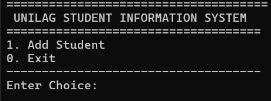
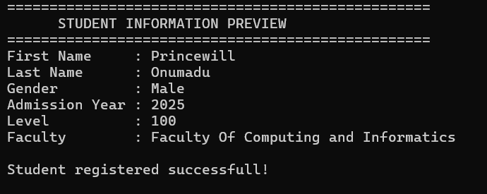

# 🎓 UNILAG Student Information System (USIS)


> A modular Student Information System developed in **C**, demonstrating structured programming, modular software design, and file-based data management.

---

# 📑 Table of Contents

- Overview
- Features
- Technologies Used
- Computer Science Concepts
- Project Structure
- Getting Started
- Screenshots
- Future Improvements
- Lessons Learned
- About the Developer
- Contributing
- License

---

# 📖 Overview

The **UNILAG Student Information System (USIS)** is a console-based application written in **C** for managing student records efficiently.

The project was created to apply programming concepts to a real-world academic system while strengthening my understanding of software engineering principles such as modularity, maintainability, and problem solving.

Rather than being a classroom exercise, USIS serves as a foundation for building larger software systems as I continue my Computer Science journey.

---

# ✨ Features

- Student Registration
- View Student Records
- Search Student Records
- Update Student Information
- Delete Student Records
- File-Based Data Storage
- Menu-Driven Interface
- Modular Program Structure

---

# 🛠 Technologies Used

- C Programming Language
- Standard C Library
- File Handling
- Structures (`struct`)
- Functions
- Modular Programming

---

# 🧠 Computer Science Concepts Demonstrated

- Structured Programming
- Modular Design
- File Handling
- Data Management
- Algorithmic Thinking
- Problem Solving
- Input Validation
- Code Organization

---

# 📂 Project Structure

```text
USIS/
│
├── include/
│   └── student.h
│
├── src/
│   ├── main.c
│   ├── student.c
│   ├── file.c
│   └── menu.c
│
├── data/
│   └── students.dat
│
└── README.md
```

---

# ⚙️ Getting Started

## Clone the Repository

```bash
git clone https://github.com/Prince-Codes7/USIS.git
```

## Navigate into the Project

```bash
cd USIS
```

## Compile

```bash
gcc src/*.c -o usis
```

## Run

```bash
./usis
```

---

# 📸 Screenshots

## Main Menu



## Register Student



## Others incoming:

- Student Registration
- Search Student
- Update Student
- Delete Student

---

# 🚀 Future Improvements

- User Authentication
- Course Registration
- GPA & CGPA Calculation
- Student Result Management
- Sorting and Filtering
- Better Error Handling
- MySQL Integration
- Graphical User Interface (GUI)
- Unit Testing
- Cross-Platform Support

---

# 📚 Lessons Learned

Building this project strengthened my understanding of:

- Modular Programming
- Writing Maintainable Code
- Working with Structures
- File Handling
- Debugging
- Problem Solving
- Software Design

More importantly, it taught me that software engineering is not only about writing code—it is about designing reliable solutions to real problems.

---

# 👨‍💻 About the Developer

## Chibueze Princewill Onumadu

Computer Science Student  
University of Lagos (UNILAG)

### Interests

- Software Engineering
- C Programming
- Systems Programming
- DevOps
- Web Development
- Cloud Computing

### Connect with Me

**LinkedIn**

https://www.linkedin.com/in/chibuezeonumadu

**GitHub**

https://github.com/Prince-Codes7

---

# 🤝 Contributing

Suggestions, improvements, and constructive feedback are welcome.

If you have ideas that can improve this project, feel free to open an Issue or submit a Pull Request.

---

# 📄 License

This project is released for educational purposes.

---

# ⭐ Support

If you found this repository useful or interesting, consider giving it a ⭐.

Thank you for visiting this project.
